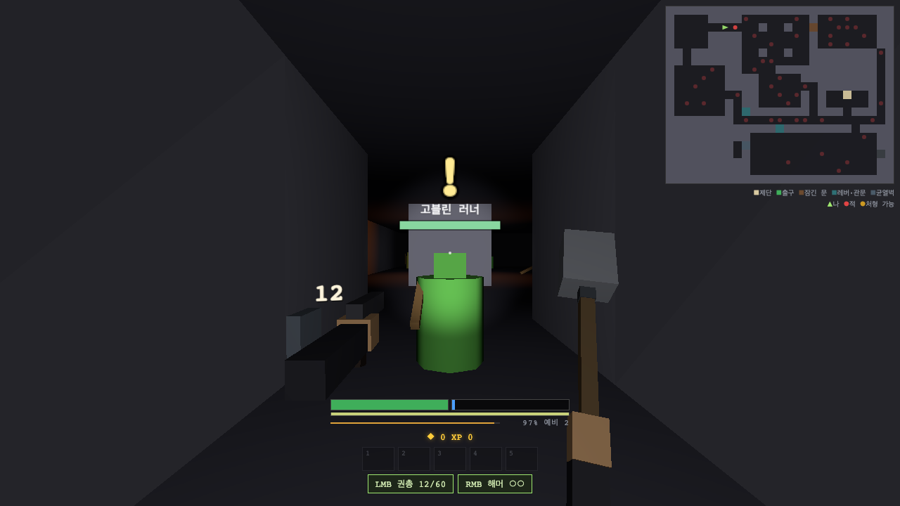

# Under World

1인칭 부머 슈터 웹 프로토타입. 어두운 지하에서 랜턴 하나로 길을 밝히며 내려간다 —
빛은 시야인 동시에 노출이라, 켜는 순간 적도 나를 본다.

**▶ 플레이: https://shimuestar.github.io/underworld/** (브라우저에서 바로 실행, 설치 없음)



## 특징

- **랜턴** — 배터리가 닳는 빛. 비추면 보이지만, 비춘 쪽도 즉시 알아챈다
- **반응 하나로 패링·방어** — 짧게 누르면 패링(6프레임 판정), 꾹 누르면 방어
- **두 자원 경제** — 총으로 죽인 적은 마나를 주지 않는다. 탄과 마법은 서로 다른 길로 번다
- **활** — 당길수록 아프고, 쏜 화살은 주워서 다시 쏜다 (가끔 부러진다)
- **스킬 24종** — 바닥에서 주워 익힌다. 패시브는 몸의 부위(눈·팔·심장·척추)에 새겨야 켜지고, 액티브는 퀵슬롯에 올려 Z·X·C·V 로 쓴다
- 고블린·거미·오크·족장까지 적 18종, 폭발 기믹, 골드 상점 제단, 소모품 가방·퀵슬롯

## 조작

| 키 | 동작 |
|---|---|
| WASD / 마우스 | 이동 / 시선 |
| 좌클릭 | 원거리 발사 — 활은 꾹 눌러 당기고 놓으면 발사 |
| 마우스 휠 | 원거리 무기 교체 (권총 · 활 · 수류탄) |
| 우클릭 | 근접 공격 · 처형 |
| Shift | 짧게 = 패링, 꾹 = 방어 |
| Space | 질주, 연타 = 회피 |
| Z X C V | 스킬 퀵슬롯 1~4 바로 사용 — 관통 뇌창은 붙들고 있는 동안 계속 뻗는다 |
| Q / 휠 클릭 | 스킬 칸 교체(회전) / 선택한 스킬 사용 |
| R / E | 재장전(활 = 시위 내리기) / 상호작용 |
| F / B | 랜턴 켜고 끄기 / 배터리 교체 |
| Tab / I | 스킬 (부위 새기기 · 퀵슬롯 배치) / 가방 |
| 1~5 | 소모품 퀵슬롯 |
| M / Esc | 미니맵 / 일시정지 |

**게임패드 지원** — Xbox 호환 패드를 꽂으면 바로 된다. 기본 배치가 잡혀 있고,
일시정지 메뉴(View 버튼)의 "패드 키 설정"에서 전부 다시 걸 수 있다.

## 로컬 실행

```bash
npm install
npm run dev   # http://localhost:5173
npm test      # Vitest — 순수 로직 테스트
```

## 만듦새

- TypeScript (strict) + Vite + Three.js (WebGL2)
- **물리 엔진 없음** — 자체 스윕 AABB + three-mesh-bvh 레이캐스트
- **에셋 없음** — 전부 프리미티브 + 단색 머티리얼, 사운드도 Web Audio 합성
- 게임 로직은 고정 60Hz 틱에서만 돈다 (렌더 루프와 분리 — 프레임 단위 패링 판정 때문)
- 모든 튜닝값은 `data/*.json` — 코드에 매직 넘버를 두지 않는다
- main 푸시마다 타입 검사·테스트를 통과한 빌드만 자동 배포된다
